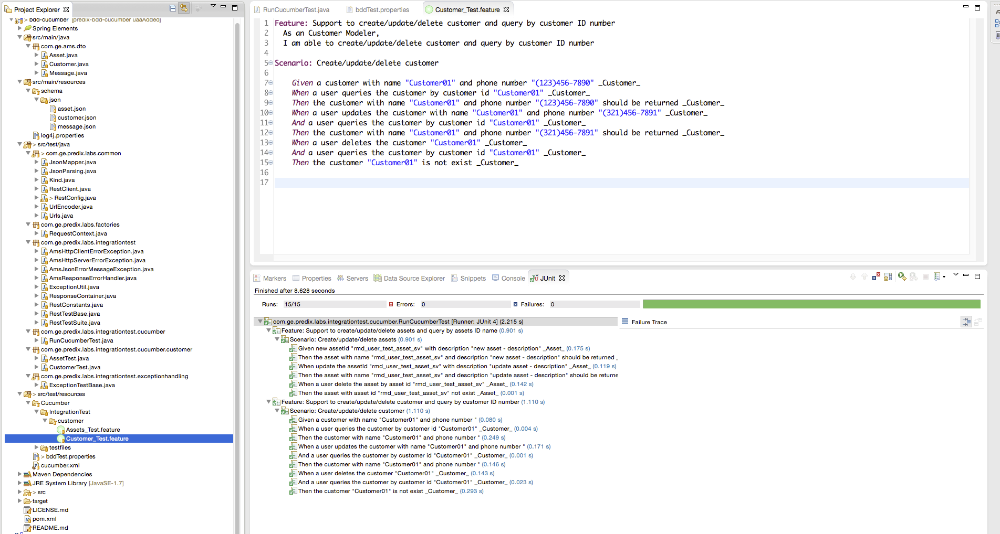

# predix-bdd-cucumber

#### Predix example Java BDD Cucumber tests

- please clone a project [SVyatkin/ads-bdd ](https://github.com/SVyatkin/ads-bdd) 

- run BDD tests from command line 

``` 
 $ mvn clean test
returns tests log and final Cucumber report like below:
 
Feature: Support to create/update/delete assets and query by assets ID name
  As an Assets Modeler,
  I am able to create/update/delete assets and query by assets ID name

  Scenario: Create/update/delete assets                                                                                       # IntegrationTest/customer/Assets_Test.feature:5
    Given new assetId "rmd_user_test_asset_sv" with description "new asset - description" _Asset_                             # AssetTest.new_assetId_with_description__Asset_(String,String)
    Then the asset with name "rmd_user_test_asset_sv" and description "new asset - description" should be returned _Asset_    # AssetTest.the_asset_with_name_and_description_should_be_returned__Asset_(String,String)
    When update the assetId "rmd_user_test_asset_sv" with description "update asset - description" _Asset_                    # AssetTest.update_the_assetId_with_description__Asset_(String,String)
    Then the asset with name "rmd_user_test_asset_sv" and description "update asset - description" should be returned _Asset_ # AssetTest.the_asset_with_name_and_description_should_be_returned__Asset_(String,String)
    When a user delete the asset by asset id "rmd_user_test_asset_sv" _Asset_                                                 # AssetTest.a_user_delete_the_asset_by_asset_id__Asset_(String)
    Then the asset with asset id "rmd_user_test_asset_sv" not exist _Asset_                                                   # AssetTest.the_asset_with_asset_id_not_exist__Asset_(String)

Feature: Support to create/update/delete customer and query by customer ID number
  As an Customer Modeler,
  I am able to create/update/delete customer and query by customer ID number

  Scenario: Create/update/delete customer                                                                   # IntegrationTest/customer/Customer_Test.feature:5
    Given a customer with name "Customer01" and phone number "(123)456-7890" _Customer_                     # CustomerTest.a_customer_with_name_and_phone_number__Customer_(String,String)
    When a user queries the customer by customer id "Customer01" _Customer_                                 # CustomerTest.a_user_queries_the_customer_by_customer_id__Customer_(String)
    Then the customer with name "Customer01" and phone number "(123)456-7890" should be returned _Customer_ # CustomerTest.the_customer_with_name_and_phone_number_should_be_returned__Customer_(String,String)
    When a user updates the customer with name "Customer01" and phone number "(321)456-7891" _Customer_     # CustomerTest.a_user_update_the_customer_with_name_and_phone_number__Customer_(String,String)
    And a user queries the customer by customer id "Customer01" _Customer_                                  # CustomerTest.a_user_queries_the_customer_by_customer_id__Customer_(String)
    Then the customer with name "Customer01" and phone number "(321)456-7891" should be returned _Customer_ # CustomerTest.the_customer_with_name_and_phone_number_should_be_returned__Customer_(String,String)
    When a user deletes the customer "Customer01" _Customer_                                                # CustomerTest.a_user_deletes_the_customer__Customer_(String)
    And a user queries the customer by customer id "Customer01" _Customer_                                  # CustomerTest.a_user_queries_the_customer_by_customer_id__Customer_(String)
    Then the customer "Customer01" is not exist _Customer_                                                  # CustomerTest.the_customer_is_not_exist__Customer_(String)

Feature: Support to create/update/delete Open Model Asset Data Service (ADS) based on Country/States/Cities hieraclely
  As an ADS Modeler,
  I am able to create/update/delete model elements and query using Graph Expression Language

  Scenario: Create and query Country/States/Cities                         # IntegrationTest/customer/CountryCities_Test.feature:5
    Given the countries table _ADS_                                        # ADSTest.the_countries_table__ADS_(WCountry>)
    And the states table _ADS_                                             # ADSTest.the_states_table__ADS_(WState>)
    And the cities table _ADS_                                             # ADSTest.the_cities_table__ADS_(WCity>)
    When a user queries a list of countries _ADS_                          # ADSTest.a_user_queries_a_list_of_countries__ADS_()
    Then a list of countries should be returned _ADS_                      # ADSTest.a_list_of_counries_should_be_returned__ADS_(String>)
    When a user queries a list of countries by city name "Vancouver" _ADS_ # ADSTest.a_user_queries_a_list_of_countries_by_city_name__ADS_(String)
    Then a list of countries should be returned _ADS_                      # ADSTest.a_list_of_counries_should_be_returned__ADS_(String>)
    When a user queries a list of states _ADS_                             # ADSTest.a_user_queries_a_list_of_states__ADS_()
    Then a list of states should be returned _ADS_                         # ADSTest.a_list_of_states_should_be_returned__ADS_(String>)
    When a user queries a list of cities _ADS_                             # ADSTest.a_user_queries_a_list_of_cities__ADS_()
    Then a list of cities should be returned _ADS_                         # ADSTest.a_list_of_cities_should_be_returned__ADS_(String>)

Feature: Support to create/update/delete Open Model Asset Data Service (ADS) based on Wind Farm and Turbines
  As an ADS Modeler,
  I am able to create/update/delete model elements and query using Graph Expression Language

  # @RunJustThisTest
  Scenario: Create and query Wind Turbine                           # IntegrationTest/customer/WindTurbine_Test.feature:5
    Given the wind farms table _WT_                                 # WTTest.the_wind_farms_table__WT_(WWindfarm>)
    And the manufacture table _WT_                                  # WTTest.the_manufacture_table__WT_(Manufacture>)
    And the wind turbines table _WT_                                # WTTest.the_wind_turbines_table__WT_(WWindturbine>)
    When a user queries a list of wind farms _WT_                   # WTTest.a_user_queries_a_list_of_wind_farms__WT_()
    Then a list of wind farms should be returned _WT_               # WTTest.a_list_of_wind_farms_should_be_returned__WT_(String>)
    When a user queries a list of wind turbine manufatures _WT_     # WTTest.a_user_queries_a_list_of_wind_turbine_manufatures__WT_()
    Then a list of wind turbine manufatures should be returned _WT_ # WTTest.a_list_of_wind_turbine_manufatures_should_be_returned__WT_(String>)
    When a user queries a list of wind turbines _WT_                # WTTest.a_useSLF4J: Failed to load class "org.slf4j.impl.StaticLoggerBinder".

    Then a list of wind turbines should be returned _WT_            # WTTest.a_list_of_wind_turbines_should_be_returned__WT_(String>)

  Scenario: Create/Validate Digital Signature for Wind Turbine    # IntegrationTest/customer/WindTurbine_Test.feature:37
    Given the wind turbine "WT01" with digital signature _WT_     # WTTest.the_wind_turbine_with_digital_signature__WT_(String,WWindturbine>)
    When a user queries "WT01" wind turbine _WT_                  # WTTest.a_user_queries_wind_turbine__WT_(String)
    Then wind turbine "WT01" signature is "true" _WT_             # WTTest.wind_turbine_signature_is__WT_(String,Boolean)
    Given the wind turbine "WT01" updated _WT_                    # WTTest.the_wind_turbine_updated__WT_(String,WWindturbine>)
    When a user queries "WT01" wind turbine _WT_                  # WTTest.a_user_queries_wind_turbine__WT_(String)
    Then wind turbine "WT01" signature is "false" _WT_            # WTTest.wind_turbine_signature_is__WT_(String,Boolean)
    Given the wind turbine "WT01" updated with new signature _WT_ # WTTest.the_wind_turbine_updated_with_new_signature__WT_(String,WWindturbine>)
    When a user queries "WT01" wind turbine _WT_                  # WTTest.a_user_queries_wind_turbine__WT_(String)
    Then wind turbine "WT01" signature is "true" _WT_             # WTTest.wind_turbine_signature_is__WT_(String,Boolean)

5 Scenarios (5 passed)
44 Steps (44 passed)
0m5.380s

Tests run: 49, Failures: 0, Errors: 0, Skipped: 0, Time elapsed: 6.07 sec - in com.ge.predix.labs.integrationtest.cucumber.RunCucumberTest

``` 
- run from Eclipse.  Open RunCucucmberTest.java and run as Junit Test



- project structure

``` 
── LICENSE.md
├── README.md
├── images
│   └── BDD-Cucumber.png
├── pom.xml
└── src
    ├── main
    │   ├── java
    │   │   └── com
    │   │       └── ge
    │   │           └── ams
    │   │               └── dto
    │   │                   ├── Asset.java
    │   │                   ├── City.java
    │   │                   ├── Country.java
    │   │                   ├── Customer.java
    │   │                   ├── Manufacture.java
    │   │                   ├── Message.java
    │   │                   ├── State.java
    │   │                   ├── Windfarm.java
    │   │                   └── Windturbine.java
    │   └── resources
    │       ├── log4j.properties
    │       └── schema
    │           └── json
    │               ├── asset.json
    │               ├── city.json
    │               ├── country.json
    │               ├── customer.json
    │               ├── manufacture.json
    │               ├── message.json
    │               ├── state.json
    │               ├── windfarm.json
    │               └── windturbine.json
    └── test
        ├── java
        │   └── com
        │       └── ge
        │           └── predix
        │               └── labs
        │                   ├── common
        │                   │   ├── JsonMapper.java
        │                   │   ├── JsonParsing.java
        │                   │   ├── Kind.java
        │                   │   ├── RestClient.java
        │                   │   ├── RestConfig.java
        │                   │   ├── UrlEncoder.java
        │                   │   └── Urls.java
        │                   ├── factories
        │                   │   └── RequestContext.java
        │                   └── integrationtest
        │                       ├── AmsHttpClientErrorException.java
        │                       ├── AmsHttpServerErrorException.java
        │                       ├── AmsJsonErrorMessageException.java
        │                       ├── AmsResponseErrorHandler.java
        │                       ├── ExceptionUtil.java
        │                       ├── ResponseContainer.java
        │                       ├── RestConstants.java
        │                       ├── RestTestBase.java
        │                       ├── RestTestSuite.java
        │                       ├── cucumber
        │                       │   ├── RunCucumberTest.java
        │                       │   └── customer
        │                       │       ├── ADSTest.java
        │                       │       ├── AssetTest.java
        │                       │       ├── CustomerTest.java
        │                       │       └── WTTest.java
        │                       └── exceptionhandling
        │                           └── ExceptionTestBase.java
        └── resources
            ├── Cucumber
            │   ├── IntegrationTest
            │   │   └── customer
            │   │       ├── Assets_Test.feature
            │   │       ├── CountryCities_Test.feature
            │   │       ├── Customer_Test.feature
            │   │       └── WindTurbine_Test.feature
            │   └── testfiles
            │       └── CarAndLocomotives.json
            ├── bddTest.properties
            └── cucumber.xml

``` 
- properties file

  bddTest.properties - file contains settings for Asset app example running in my space.  You need to set up your own for development.
  
- new DTO object

  Use your own json skema to create your own DTO object. And put jsonschema2pojo-maven-plugin references in pom.xml file. 

- cucumber tests

  Cucumber tests locates in predix-bdd-cucumber/src/test/resources/Cucumber/IntegrationTest/customer/
 ```  
  Assets_Test.feature
  Customer_Test.feature
 ``` 
- BDD Cucumber plugin for Eclipse 
  https://github.com/rlogiacco/Natural/wiki/Installation-Guide

## Example how to create Asset Management service and bind it to your dummy app for the BDD test  
### Bind service to app

``` 
          //push your dummy app predix_assetbdd into Cloud
$ cf push
$ cf create-service predix-uaa Beta uaa_bdd_test -c '{"adminClientSecret":"admin_secret"}'
$ cf bs predix_assetbdd uaa_bdd_test   
$ cf restage predix_assetbdd
$ cf e predix_assetbdd
``` 

### Bind assset service with uaa service using "issuerId" from app environment

``` 
$ cf cs predix-asset Beta asset_bdd_test -c '{"trustedIssuerIds": ["https://ae902176-c00b-49ef-8ef3-f42ad6f24e8d.predix-uaa.run.aws-usw02-pr.ice.predix.io/oauth/token"]}'

``` 
### UAAC using "uri" from "predix-uaa" in app environment

``` 
$ uaac target https://ae902176-c00b-49ef-8ef3-f42ad6f24e8d.predix-uaa.run.aws-usw02-pr.ice.predix.io
$ uaac token client get admin

``` 

### Create new client using asset instanceId aka zone or Predix-Zone-Id (Header's name) from predix-asset\instanceId field value and put it as predix-asset.zones.<predix-asset\instanceId>.user    

``` 
$ uaac client add uaa_client_bdd 
        --authorities openid,uaa.none,uaa.resource,predix-asset.zones.c026020a-95d0-4838-ba34-a7d26f083ee3.user 
        --scope uaa.none,openid,predix-asset.zones.c026020a-95d0-4838-ba34-a7d26f083ee3.user 
        --autoapprove openid 
        --authorized_grant_types client_credentials

$ uaac token client get uaa_client_bdd
$ uaac context
``` 
  

 

